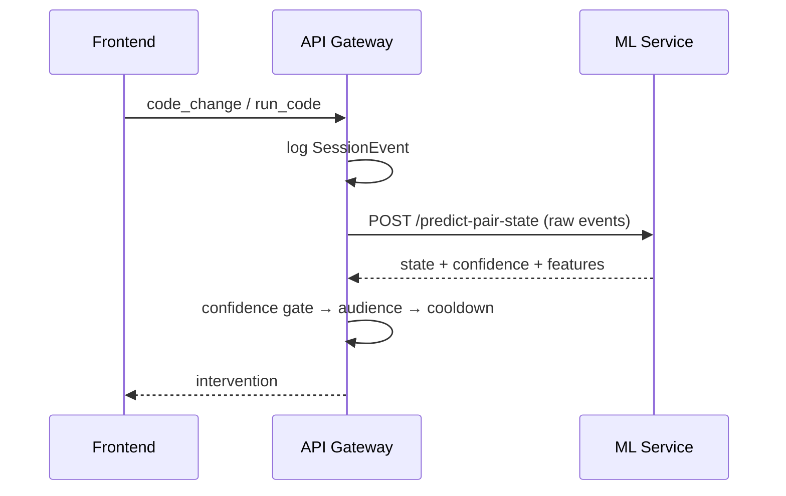

# Diagrams

Diagrams for the dissertation and presentations. Keep the **source** here, not
just exported images, so they can be edited later.

## What belongs here

| Diagram | Shows | Where it's used |
|---|---|---|
| `system-architecture` | Three services, datastores, what talks to what | Dissertation Ch. 3, panel slides |
| `session-sequence` | One session end to end: event → prediction → intervention | Dissertation Ch. 3 |
| `ml-pipeline` | Events → windows → labels → model, with the guard at each step | Dissertation Ch. 4 |
| `state-taxonomy` | The five states and their distinguishing signals | Appendix, panel slides |
| `erd` | Database entities and relationships | Appendix A |

## Conventions

- Keep the editable source (`.drawio`, `.excalidraw`, `.mmd`) **and** an export
  (`.png` or `.svg`) with the same base name
- SVG for anything going in the dissertation — it stays sharp in print
- Name by content, not by tool: `session-sequence.svg`, not `diagram3.svg`

## Text-based alternative

Mermaid diagrams live as text, so they diff properly in git and can be edited
without a tool. GitHub renders them inline.

````markdown

````

## Drawing from the source, not from memory

Two details are easy to get wrong and both matter:

**The frontend does not talk to the ML service during a session.** The API
orchestrates everything. The only exception is the sandbox page, a developer
tool — don't draw it as a normal path.

**Interventions are not always broadcast.** Some reach one student only. A
diagram showing every nudge going to both misrepresents a deliberate design
decision.

For the current, accurate flow see
[`../architecture.md`](../architecture.md); for contracts see
[`../inter-service-events.md`](../inter-service-events.md).
